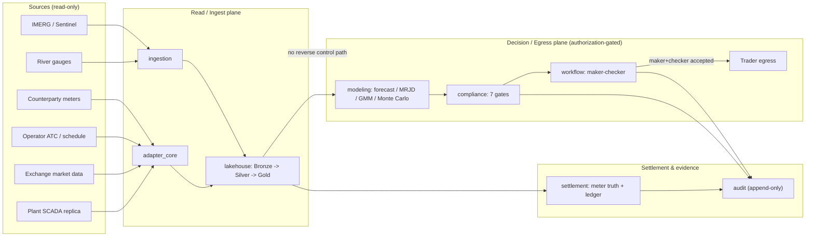

# BBIN Hydropower Platform — Reference Implementation

Python reference implementation of the verifiable behavioral logic for the BBIN
(Bangladesh–Bhutan–India–Nepal) cross-border hydropower trading and settlement platform: an
independent analytics, market-interface, and settlement-evidence layer that enforces
non-negotiable safety invariants (no grid-control path, meter-truth settlement, operator-declared
ATC truth, maker-checker authorization) while optimizing the joint hydrology and price risk.

All **57 correctness properties** are implemented exactly once as property-based tests and pass
(**64 tests total**). Every module byte-compiles cleanly.

---

## 1. Prerequisites

- **Python 3.11+** (verified on CPython 3.11.15).
- Three packages: `numpy`, `hypothesis`, and `pytest` (the test runner).

> Only Python is required. The wider polyglot stack the architecture targets
> (Go/Rust/Java/Kafka/Spark) is **not** needed to run this reference build. See
> "What is and isn't here" at the bottom.

---

## 2. Step-by-step: set up and run

All commands run from the repository root (the folder containing this `README.md`).

### Step 1 — Enter the repository

```powershell
cd bbin-platform        # or wherever you cloned it
```

### Step 2 — Create an isolated virtual environment

```powershell
py -3.11 -m venv .venv
```

If the `py` launcher or the Windows Store Python stub is broken, point at a real CPython 3.11
interpreter directly, for example:

```powershell
& "C:\path\to\python3.11.exe" -m venv .venv
```

On macOS / Linux:

```bash
python3.11 -m venv .venv
```

### Step 3 — Install the dependencies

```powershell
.\.venv\Scripts\python.exe -m pip install --upgrade pip numpy hypothesis pytest
```

```bash
# macOS / Linux
./.venv/bin/python -m pip install --upgrade pip numpy hypothesis pytest
```

Verify they import:

```powershell
.\.venv\Scripts\python.exe -c "import hypothesis, numpy; print('hypothesis', hypothesis.__version__, '| numpy', numpy.__version__)"
```

### Step 4 — Make the package importable

The package lives at the repository root, so put the root on `PYTHONPATH`:

```powershell
# PowerShell
$env:PYTHONPATH = "$PWD"
```

```cmd
:: cmd.exe
set PYTHONPATH=%CD%
```

```bash
# macOS / Linux
export PYTHONPATH="$PWD"
```

### Step 5 — Compile-check every module (optional but fast)

```powershell
.\.venv\Scripts\python.exe -m compileall bbin_platform
# Expected: exit code 0, no errors
```

### Step 6 — Run the full property-based test suite

```powershell
.\.venv\Scripts\python.exe -m pytest tests -q
# Expected: 64 passed
```

### Step 7 (optional) — Run a single module's tests or one property

```powershell
# One test file
.\.venv\Scripts\python.exe -m pytest tests\test_hard_controls.py -q

# One property by name (e.g. Property 1, the no-SCADA-control guard)
.\.venv\Scripts\python.exe -m pytest tests -q -k "property_1"

# More detail
.\.venv\Scripts\python.exe -m pytest tests -v
```

### Step 8 (optional) — Confirm all 57 properties are covered

```powershell
.\.venv\Scripts\python.exe -c "import re,glob; nums=set(); [nums.add(int(m)) for f in glob.glob('tests/*.py') for m in re.findall(r'Property (\d+):', open(f,encoding='utf-8').read())]; print('covered:', len(nums)); print('missing:', sorted(set(range(1,58))-nums))"
# Expected: covered: 57   missing: []
```

### Step 9 (optional) — Use the library interactively

```powershell
.\.venv\Scripts\python.exe
```
```python
>>> from bbin_platform.schemas import VolumeBounds
>>> from bbin_platform.hard_controls import executable_volume
>>> executable_volume(VolumeBounds(approved_mw=120, access_mw=100, governing_atc_mw=80, generation_available_mw=95, contract_ceiling_mw=110))
80.0   # bounded by the governing ATC
```

### Step 10 — See the whole platform run end-to-end (demo)

The modules are verified building blocks. To watch them work together as one forecast cycle that
produces an actual bid decision card, run the demo pipeline:

```powershell
$env:PYTHONPATH = "$PWD"
.\.venv\Scripts\python.exe -m demo.run_pipeline
```

It runs the full chain on synthetic-but-realistic data:

```
hydrology ingestion (gauge -> QC -> rating curve -> generation)
  -> price calibration (exact-OU recovery, half-life)
  -> Monte Carlo (100,000 seeded paths -> G_firm90, price P10/P50/P90)
  -> corridor constraints (declared ATC truth, capacity inequality)
  -> bid sizing (executable-volume bound = min of all constraints)
  -> seven compliance gates -> immutable ruleset binding -> maker-checker
  -> egress guard (commercial bid ALLOWED, SCADA control DENIED)
  -> fail-closed cycle gates -> settlement (net revenue, append-only ledger + audit)
  -> DECISION CARD
```

This is a **demonstration**, not production: the data is synthetic, there is no message broker or
lakehouse backend, and no legal instruments are executed. It exists so you can see the verified
logic produce a real, end-to-end decision. The recommendation it prints is **advisory** by design
and would require an authorized trader to accept it before becoming an order.

### Step 11 — Run the live local service

The demo above runs one cycle and exits. The **service** runs continuously: a background scheduler
executes a forecast cycle for every configured plant on an interval, and a read-only HTTP control
plane exposes the results. It is standard-library only (no web framework to install), so it runs
anywhere Python does.

Start it (fast demo cadence shown; omit the flags for the production 15-minute / 100k-path
defaults):

```powershell
$env:PYTHONPATH = "$PWD"
.\.venv\Scripts\python.exe -m service --interval 8 --paths 60000 --port 8077
```

In another shell, query it:

```powershell
curl http://127.0.0.1:8077/health                 # uptime + cycles run
curl http://127.0.0.1:8077/plants                  # configured plants
curl http://127.0.0.1:8077/decisions               # latest decision per plant
curl http://127.0.0.1:8077/decisions/KALIGANDAKI_A # full decision + trail for one plant
curl http://127.0.0.1:8077/history/KALIGANDAKI_A   # recent cycle summaries
```

Record a maker-checker acceptance for a cycle (separation of duties is enforced: the checker must
be a different actor than the maker, else HTTP 409):

```powershell
# replace CYCLE with a cycle_id from /decisions
curl -X POST http://127.0.0.1:8077/approvals/CYCLE -H "Content-Type: application/json" -d '{\"actor\":\"trader.alice\",\"role\":\"maker\"}'
curl -X POST http://127.0.0.1:8077/approvals/CYCLE -H "Content-Type: application/json" -d '{\"actor\":\"compliance.bob\",\"role\":\"checker\"}'
```

| Endpoint | Method | Purpose |
| --- | --- | --- |
| `/health` | GET | Liveness, uptime, cycles run |
| `/plants` | GET | Configured plants |
| `/decisions` | GET | Latest decision for every plant |
| `/decisions/{plant_id}` | GET | Full latest decision + trail for one plant |
| `/history/{plant_id}` | GET | Recent decision summaries for one plant |
| `/approvals/{cycle_id}` | GET | Current maker-checker approval record |
| `/approvals/{cycle_id}` | POST | Record a maker/checker acceptance |

Every GET is read-only. The single mutating endpoint only records a maker-checker acceptance and
enforces separation of duties; it never transmits to a counterparty (there is no counterparty
transport here), and the API surface carries no execute scope toward any operational network.
Decisions remain **advisory**. Like the demo, the service uses synthetic data with no broker,
lakehouse, or executed legal instruments.

---

## 3. Troubleshooting

| Symptom | Cause / fix |
| --- | --- |
| `No module named bbin_platform` | `PYTHONPATH` not set to the repository root (Step 4). |
| `No module named pytest` / `hypothesis` | Dependencies not installed into the venv (Step 3). |
| `py -3.11` fails with `0x80070002` | Windows Store Python stub is broken; point at a real interpreter path in Step 2. |
| Tests slow | Property tests run 100–200 examples each by design; the full suite finishes in roughly 8–15 s. |

---

## 4. Project structure

```mermaid
graph TD
    ROOT["bbin-platform/ (repository root)"]

    ROOT --> PYPROJ["pyproject.toml"]
    ROOT --> RDME["README.md (this file)"]
    ROOT --> GI[".gitignore"]
    ROOT --> PKG["bbin_platform/ — verified core package"]
    ROOT --> DEMO["demo/ — end-to-end pipeline"]
    ROOT --> SVC["service/ — live local service"]
    ROOT --> TESTS["tests/ — 64 property tests"]

    PKG --> SCH["schemas.py — canonical contracts"]
    PKG --> AC["adapter_core.py — envelope/sig/seq/dedup"]
    PKG --> HC["hard_controls.py — 7 invariant cores"]
    PKG --> INT["integrity.py — checksum/schema/manifest"]
    PKG --> CMP["compliance.py — 7 approval gates"]
    PKG --> WF["workflow.py — maker-checker state machine"]
    PKG --> STL["settlement.py — meter truth/ledger/credit"]
    PKG --> ING["ingestion.py — gauge/IMERG/Sentinel"]
    PKG --> LH["lakehouse.py — bronze/silver/gold/lineage"]
    PKG --> MDL["modeling.py — MRJD/GMM/MonteCarlo"]
    PKG --> CYC["cycle.py — fail-closed forecast gating"]

    DEMO --> RUN["run_pipeline.py"]

    SVC --> ENG["engine.py — one cycle -> CycleResult"]
    SVC --> SCHED["scheduler.py — background cycle loop"]
    SVC --> STATE["state.py — in-memory state store"]
    SVC --> API["api.py — stdlib HTTP control plane"]
    SVC --> MAIN["__main__.py — python -m service"]

    TESTS --> T1["test_hard_controls.py"]
    TESTS --> T2["test_adapter_core.py"]
    TESTS --> T3["test_compliance_settlement.py"]
    TESTS --> T4["test_ingestion_lakehouse.py"]
    TESTS --> T5["test_modeling_cycle.py"]
    TESTS --> T6["test_integrity.py"]

    T1 -.tests.-> HC
    T2 -.tests.-> AC
    T3 -.tests.-> CMP
    T3 -.tests.-> WF
    T3 -.tests.-> STL
    T4 -.tests.-> ING
    T4 -.tests.-> LH
    T5 -.tests.-> MDL
    T5 -.tests.-> CYC
    T6 -.tests.-> INT
```



### Module responsibilities

| Module | Covers |
| --- | --- |
| `bbin_platform/schemas.py` | Canonical contracts: gateway/gauge envelopes, Declared ATC, ruleset, volume bounds, lineage |
| `bbin_platform/adapter_core.py` | Envelope validation, signature verify, sequence-gap, dedup, quarantine, audit |
| `bbin_platform/hard_controls.py` | No-SCADA egress guard, schedule immutability, ATC truth, volume bound, maker-checker, meter-truth, ruleset binding |
| `bbin_platform/integrity.py` | Checksum-registration gate, schema backward-transitive compatibility, manifest verify |
| `bbin_platform/compliance.py` | Seven sequential approval gates, advisory status, four-eye, ruleset holds, GNA/T-GNA, confirmation matching |
| `bbin_platform/workflow.py` | Maker-checker lifecycle state machine, adverse-event invalidation, schedule transitions |
| `bbin_platform/settlement.py` | Meter class 0.2S, divergence holds, curtailment neutrality, append-only ledger/audit, credit, performance fee |
| `bbin_platform/ingestion.py` | Gauge QC, 15-min aggregation, IMERG 0.1° subsetting, Sentinel cloud screening, discharge-lag identification |
| `bbin_platform/lakehouse.py` | Bronze append-only, rating-curve-versioned discharge, physical caps, ATC revision windowing, leakage-safe features, lineage |
| `bbin_platform/modeling.py` | MRJD numerics, GMM HAC, Monte Carlo, generation quantiles, promotion/regime gates |
| `bbin_platform/cycle.py` | Forecast-cycle fail-closed gating (stale-input block, order prerequisites) |
| `service/` | Live local service: forecast-cycle engine, scheduler, in-memory state, stdlib HTTP control plane |
| `demo/run_pipeline.py` | One end-to-end forecast cycle that prints a decision card |

---

## 5. Runtime data flow (how the pieces connect)



---

## 6. What is and isn't here

**Implemented and verified (Python):** all behavioral logic — the hard-control invariants, the
ICD-adapter ingress logic, hydrology and Earth-observation algorithms, the medallion-lakehouse
transforms, the full quantitative modeling suite, compliance gates, the maker-checker workflow,
settlement/credit/audit, and the forecast-cycle gating. Covered by 64 property-based tests over all
57 correctness properties, plus an end-to-end demo and a live local service.

**Not in this repository (intentionally out of scope):** the polyglot deployment (Go/Rust/Java
services), the infrastructure planes (Kafka, Schema Registry, mTLS/PKI, network segmentation),
Spark/Delta storage backends, and live external integrations (NASA Earthdata, Copernicus CDSE, real
counterparty interface-control documents). These require toolchains, runtimes, and executed
legal/credential instruments beyond a reference build. Where the architecture assigns Go/Rust/Java,
the equivalent logic is realized and verified here in Python.

A software connection alone cannot authorize cross-border trade: production activation additionally
requires executed data-sharing, trading, scheduling, and settlement instruments with each
counterparty, plus the relevant regulatory approvals. Recommendations produced here are advisory.

---

## License

This project is **dual-licensed**. You may use it under **either**:

1. The **GNU Affero General Public License v3.0** ([`LICENSE`](LICENSE)) — free
   of charge, but you must disclose your source code (including for hosted/SaaS
   use), state any changes you made, and preserve attribution. The software is
   provided with **no warranty and no liability**.

2. A paid **Commercial License** ([`COMMERCIAL-LICENSE.md`](COMMERCIAL-LICENSE.md))
   — for closed-source, proprietary, or private hosted use without the AGPL
   obligations. Fees are negotiated and vary over time.

See [`LICENSING.md`](LICENSING.md) for a full comparison, and [`NOTICE`](NOTICE)
for attribution requirements. For a commercial quote, contact
<anubhavprasai123@gmail.com> or <himangsuadk@gmail.com>.

> This software is a reference implementation and is **not** certified for
> safety-critical, industrial, energy, or hydropower control use. Use at your
> own risk.
