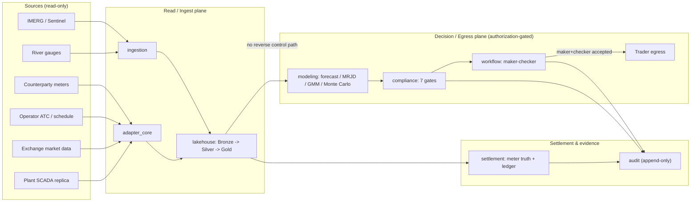

# BBIN Hydropower Platform — Reference Implementation

Python reference implementation of the BBIN Hydropower Platform's verifiable behavioral logic.
The full spec lives in `.kiro/specs/bbin-hydropower-platform/` (requirements, design, tasks), and
a complete written report is in `../bbin-platform-report.tex` / `.pdf`.

All **57 design correctness properties** are implemented exactly once as property-based tests and
pass (**64 tests total**). Every module byte-compiles cleanly.

---

## 1. Prerequisites

- **Python 3.11+** (the reference build was verified on CPython 3.11.15).
- Ability to create a virtual environment and install two packages: `hypothesis` and `numpy`
  (`pytest` is used as the runner).

> Only Python is required. The design's wider polyglot stack (Go/Rust/Java/Kafka/Spark) is **not**
> needed to run this reference build — see "What is and isn't here" at the bottom.

---

## 2. Step-by-step: set up and run

The commands below assume the **workspace root** `AI_MODEL/` (the folder that contains both
`bbin-platform/` and, after step 2, `.venv/`).

### Step 1 — Open a terminal at the workspace root

```powershell
cd C:\Users\Hridaya\Desktop\AI_MODEL
```

### Step 2 — Create an isolated virtual environment

Use a real CPython 3.11 interpreter. If the `py` launcher works:

```powershell
py -3.11 -m venv .venv
```

If the Windows Store Python stub is broken (as on the reference machine), point at the actual
interpreter, e.g. the uv-managed one:

```powershell
& "$env:APPDATA\uv\python\cpython-3.11.15-windows-x86_64-none\python.exe" -m venv .venv
```

### Step 3 — Install the dependencies

```powershell
.\.venv\Scripts\python.exe -m pip install --upgrade pip hypothesis numpy pytest
```

Verify they import:

```powershell
.\.venv\Scripts\python.exe -c "import hypothesis, numpy; print('hypothesis', hypothesis.__version__, '| numpy', numpy.__version__)"
```

### Step 4 — Make the package importable

The package lives under `bbin-platform/`, so put that folder on `PYTHONPATH`:

```powershell
# PowerShell
$env:PYTHONPATH = "$PWD\bbin-platform"
```

```cmd
:: cmd.exe
set PYTHONPATH=%CD%\bbin-platform
```

### Step 5 — Compile-check every module (optional but fast)

```powershell
.\.venv\Scripts\python.exe -m compileall bbin-platform\bbin_platform
# Expected: exit code 0, no errors
```

### Step 6 — Run the full property-based test suite

```powershell
.\.venv\Scripts\python.exe -m pytest bbin-platform\tests -q
# Expected: 64 passed
```

### Step 7 (optional) — Run a single module's tests or one property

```powershell
# One test file
.\.venv\Scripts\python.exe -m pytest bbin-platform\tests\test_hard_controls.py -q

# One property by name (e.g. Property 1, the no-SCADA-control guard)
.\.venv\Scripts\python.exe -m pytest bbin-platform\tests -q -k "property_1"

# More detail / show which properties ran
.\.venv\Scripts\python.exe -m pytest bbin-platform\tests -v
```

### Step 8 (optional) — Confirm all 57 properties are covered

```powershell
.\.venv\Scripts\python.exe -c "import re,glob; nums=set(); [nums.add(int(m)) for f in glob.glob('bbin-platform/tests/*.py') for m in re.findall(r'Property (\d+):', open(f,encoding='utf-8').read())]; print('covered:', len(nums)); print('missing:', sorted(set(range(1,58))-nums))"
# Expected: covered: 57   missing: []
```

### Step 9 (optional) — Use the library interactively

```powershell
.\.venv\Scripts\python.exe
```
```python
>>> from bbin_platform.schemas import VolumeBounds
>>> from bbin_platform.hard_controls import executable_volume
>>> executable_volume(VolumeBounds(approved_mw=120, access_mw=100, governing_atc_mw=80, generation_available_mw=95, contract_ceiling_mw=110))
80.0   # bounded by the governing ATC
```

### Step 10 — See the whole platform run end-to-end (demo)

The modules above are verified building blocks. To watch them work together as one
forecast cycle that produces an actual bid decision card, run the demo pipeline:

```powershell
$env:PYTHONPATH = "$PWD\bbin-platform"
.\.venv\Scripts\python.exe -m demo.run_pipeline
```

It runs the full chain on synthetic-but-realistic data:

```
hydrology ingestion (gauge -> QC -> rating curve -> generation)
  -> price calibration (exact-OU recovery, half-life)
  -> Monte Carlo (100,000 seeded paths -> G_firm90, price P10/P50/P90)
  -> corridor constraints (declared ATC truth, capacity inequality)
  -> bid sizing (executable-volume bound = min of all constraints)
  -> seven compliance gates -> immutable ruleset binding -> maker-checker
  -> egress guard (commercial bid ALLOWED, SCADA control DENIED)
  -> fail-closed cycle gates -> settlement (net revenue, append-only ledger + audit)
  -> DECISION CARD
```

This is a **demonstration**, not production: the data is synthetic, there is no message
broker or lakehouse backend, and no legal instruments are executed. It exists so you can
see the verified logic produce a real, end-to-end decision. The recommendation it prints is
**advisory** by design and would require an authorized trader to accept it before becoming an
order.

### Step 11 — Run the live local service (Level 2)

The demo above runs one cycle and exits. The **service** runs continuously: a background
scheduler executes a forecast cycle for every configured plant on an interval, and a read-only
HTTP control plane exposes the results. It is standard-library only (no web framework to
install), so it runs anywhere Python does.

Start it (fast demo cadence shown; omit the flags for the production 15-minute / 100k-path
defaults):

```powershell
$env:PYTHONPATH = "$PWD\bbin-platform"
.\.venv\Scripts\python.exe -m service --interval 8 --paths 60000 --port 8077
```

In another shell, query it:

```powershell
curl http://127.0.0.1:8077/health                 # uptime + cycles run
curl http://127.0.0.1:8077/plants                  # configured plants
curl http://127.0.0.1:8077/decisions               # latest decision per plant
curl http://127.0.0.1:8077/decisions/KALIGANDAKI_A # full decision + trail for one plant
curl http://127.0.0.1:8077/history/KALIGANDAKI_A   # recent cycle summaries
```

Record a maker-checker acceptance for a cycle (separation of duties is enforced: the checker
must be a different actor than the maker, else HTTP 409):

```powershell
# replace CYCLE with a cycle_id from /decisions
curl -X POST http://127.0.0.1:8077/approvals/CYCLE -H "Content-Type: application/json" -d '{\"actor\":\"trader.alice\",\"role\":\"maker\"}'
curl -X POST http://127.0.0.1:8077/approvals/CYCLE -H "Content-Type: application/json" -d '{\"actor\":\"compliance.bob\",\"role\":\"checker\"}'
```

| Endpoint | Method | Purpose |
| --- | --- | --- |
| `/health` | GET | Liveness, uptime, cycles run |
| `/plants` | GET | Configured plants |
| `/decisions` | GET | Latest decision for every plant |
| `/decisions/{plant_id}` | GET | Full latest decision + trail for one plant |
| `/history/{plant_id}` | GET | Recent decision summaries for one plant |
| `/approvals/{cycle_id}` | GET | Current maker-checker approval record |
| `/approvals/{cycle_id}` | POST | Record a maker/checker acceptance |

Every GET is read-only. The single mutating endpoint only records a maker-checker acceptance
and enforces separation of duties; it never transmits to a counterparty (there is no
counterparty transport here), and the API surface carries no execute scope toward any
operational network. Decisions remain **advisory**. Like the demo, the service uses synthetic
data with no broker, lakehouse, or executed legal instruments.

Service layout (`bbin-platform/service/`):

```
service/
  engine.py      one forecast cycle -> structured CycleResult (reusable core)
  scheduler.py   background daemon that runs cycles on an interval
  state.py       thread-safe in-memory latest/history/approvals store
  api.py         stdlib http.server read-only control plane + approval endpoint
  __main__.py    entrypoint: python -m service
```

---

## 3. Troubleshooting

| Symptom | Cause / fix |
| --- | --- |
| `No module named bbin_platform` | `PYTHONPATH` not set to the `bbin-platform/` folder (Step 4). |
| `No module named pytest` / `hypothesis` | Dependencies not installed into the venv (Step 3). |
| `py -3.11` fails with `0x80070002` | Windows Store Python stub is broken; use the explicit interpreter path in Step 2. |
| Tests slow | Property tests run ≥100–200 examples each by design; the full suite finishes in ~8–11 s. |

---

## 4. Project structure

```mermaid
graph TD
    ROOT["AI_MODEL/ (workspace root)"]

    ROOT --> PLAN["plan.md — source blueprint"]
    ROOT --> PROG["progress.md — build log"]
    ROOT --> REPT["bbin-platform-report.tex / .pdf — full report"]
    ROOT --> VENV[".venv/ — virtual environment"]
    ROOT --> SPEC[".kiro/specs/bbin-hydropower-platform/"]
    ROOT --> PLAT["bbin-platform/ — reference implementation"]

    SPEC --> REQ["requirements.md — 32 EARS requirements"]
    SPEC --> DES["design.md — architecture + 57 properties"]
    SPEC --> TSK["tasks.md — 29-task plan"]
    SPEC --> CFG[".config.kiro"]

    PLAT --> PYPROJ["pyproject.toml"]
    PLAT --> PLATREADME["README.md (this file)"]
    PLAT --> PKG["bbin_platform/ — package"]
    PLAT --> TESTS["tests/ — 64 property tests"]

    PKG --> SCH["schemas.py — canonical contracts"]
    PKG --> AC["adapter_core.py — envelope/sig/seq/dedup"]
    PKG --> HC["hard_controls.py — 7 invariant cores"]
    PKG --> INT["integrity.py — checksum/schema/manifest"]
    PKG --> CMP["compliance.py — 7 approval gates"]
    PKG --> WF["workflow.py — maker-checker state machine"]
    PKG --> STL["settlement.py — meter truth/ledger/credit"]
    PKG --> ING["ingestion.py — gauge/IMERG/Sentinel"]
    PKG --> LH["lakehouse.py — bronze/silver/gold/lineage"]
    PKG --> MDL["modeling.py — MRJD/GMM/MonteCarlo"]
    PKG --> CYC["cycle.py — fail-closed forecast gating"]

    TESTS --> T1["test_hard_controls.py"]
    TESTS --> T2["test_adapter_core.py"]
    TESTS --> T3["test_compliance_settlement.py"]
    TESTS --> T4["test_ingestion_lakehouse.py"]
    TESTS --> T5["test_modeling_cycle.py"]
    TESTS --> T6["test_integrity.py"]

    T1 -.tests.-> HC
    T2 -.tests.-> AC
    T3 -.tests.-> CMP
    T3 -.tests.-> WF
    T3 -.tests.-> STL
    T4 -.tests.-> ING
    T4 -.tests.-> LH
    T5 -.tests.-> MDL
    T5 -.tests.-> CYC
    T6 -.tests.-> INT
```



### Module responsibilities

| Module | Spec tasks | Covers |
| --- | --- | --- |
| `schemas.py` | 1.2 | Canonical contracts: gateway/gauge envelopes, Declared ATC, ruleset, volume bounds, lineage |
| `adapter_core.py` | 3 | Envelope validation, signature verify, sequence-gap, dedup, quarantine, audit |
| `hard_controls.py` | 4 | No-SCADA egress guard, schedule immutability, ATC truth, volume bound, maker-checker, meter-truth, ruleset binding |
| `integrity.py` | 2.2 | Checksum-registration gate, schema backward-transitive compat, manifest verify |
| `compliance.py` | 23 | Seven sequential approval gates, advisory status, four-eye, ruleset holds, GNA/T-GNA, confirmation matching |
| `workflow.py` | 23.6 | Maker-checker lifecycle state machine, adverse-event invalidation, schedule transitions |
| `settlement.py` | 25 | Meter class 0.2S, divergence holds, curtailment neutrality, append-only ledger/audit, credit, performance fee |
| `ingestion.py` | 11 | Gauge QC, 15-min aggregation, IMERG 0.1° subsetting, Sentinel cloud screening, discharge-lag ID |
| `lakehouse.py` | 13–15 | Bronze append-only, rating-curve-versioned discharge, physical caps, ATC revision windowing, leakage-safe features, lineage |
| `modeling.py` | 17–21 | MRJD numerics, GMM HAC, Monte Carlo, generation quantiles, promotion/regime gates |
| `cycle.py` | 27.2 | Forecast-cycle fail-closed gating (stale-input block, order prerequisites) |

---

## 5. Runtime data flow (how the pieces connect)



---

## 6. What is and isn't here

**Implemented and verified (Python):** all behavioral logic — the hard-control invariants, the
ICD-adapter ingress logic, hydrology/EO algorithms, the medallion-lakehouse transforms, the full
quantitative modeling suite, compliance gates, the maker-checker workflow, settlement/credit/audit,
and the forecast-cycle gating. Covered by 64 property-based tests over all 57 design properties.

**Deferred (documented in `tasks.md`):** the polyglot deployment (Go/Rust/Java services), the
infrastructure planes (Kafka, Schema Registry, mTLS/PKI, network segmentation), Spark/Delta
storage backends, and live external integrations (NASA Earthdata, Copernicus CDSE, real
counterparty ICDs). These require toolchains, runtimes, and executed legal/credential instruments
not present in this environment. Where the design assigned Go/Rust/Java, the equivalent logic was
realized in Python and noted per task.
